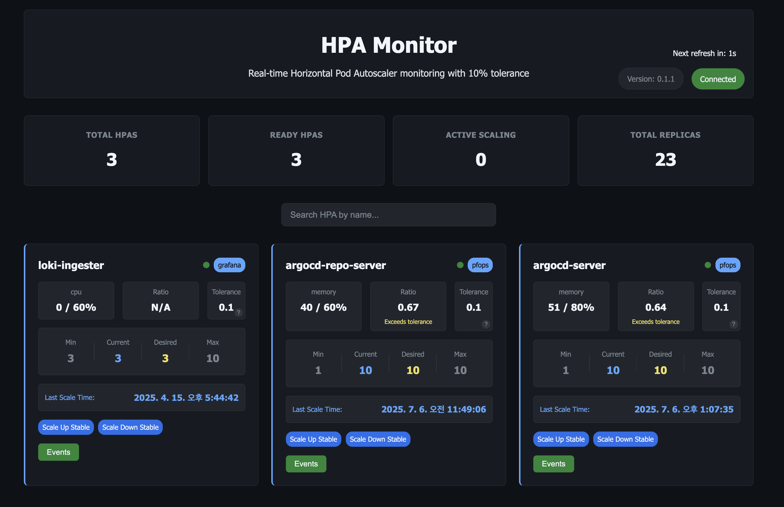

# HPA Monitor

[](go.mod)
[](https://github.com/younsl/hpa-monitor/releases)
[](LICENSE)

A Kubernetes HPA (Horizontal Pod Autoscaler) monitoring application with real-time dashboard and WebSocket updates.



The dashboard provides real-time monitoring of HPA resources with tolerance calculations, showing current vs desired replicas, scaling status, and recent events.

## Features

- Real-time HPA monitoring with tolerance calculations
- Multi-metric support (CPU, memory, custom metrics)
- WebSocket-based live updates
- Kubernetes events tracking
- Web dashboard interface

## Quick Start

### Prerequisites

- Go 1.24+
- Docker
- Kubernetes cluster (or KWOK for testing)
- Helm 3.x

### Development

```bash
# Run locally
make run

# Build binary
make build

# Run tests
make test
```

### Deployment

#### Helm Installation

```bash
# Install from a specific values file
helm upgrade --install hpa-monitor ./charts/hpa-monitor \
  --namespace hpa-monitor \
  --create-namespace \
  --values ./charts/hpa-monitor/values.yaml
```

#### Quick Deployment

```bash
# Deploy to KWOK cluster (recommended for testing)
make deploy-kwok

# Or deploy to existing cluster
make deploy
```

### Access

- Web Dashboard: http://localhost:8080 (or port-forward)
- NodePort: http://localhost:30080 (KWOK cluster)

## Configuration

Environment variables:
- `PORT` - Server port (default: 8080)
- `WEBSOCKET_INTERVAL` - Update interval in seconds (default: 5)
- `TOLERANCE` - HPA tolerance percentage (default: 0.1)

## Commands

```bash
make run              # Run locally
make build            # Build binary
make test             # Run tests
make docker-build     # Build container
make deploy           # Deploy to cluster
make check-hpa        # Check HPA status
make logs             # View logs
make clean            # Clean artifacts
```

## Architecture

- **Backend**: Go with Gin framework
- **Frontend**: HTML/JavaScript with WebSocket
- **Deployment**: Helm chart with RBAC
- **Monitoring**: Kubernetes client-go with custom tolerance logic
